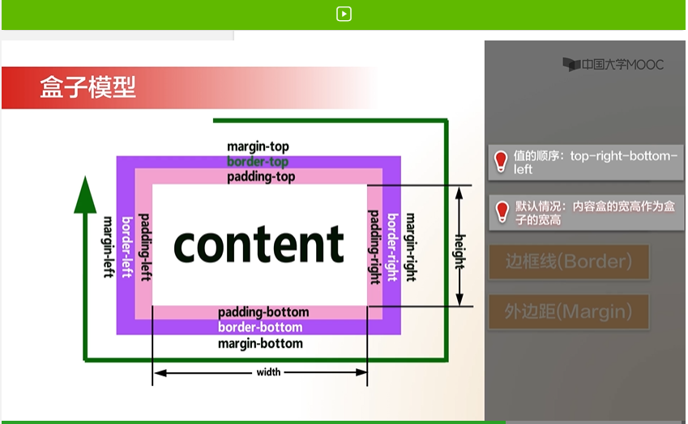
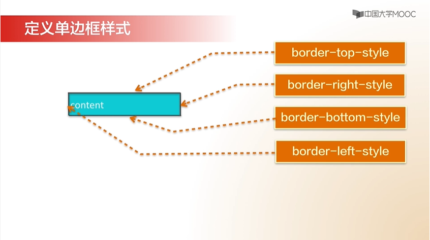
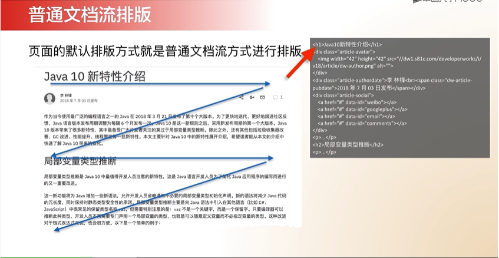
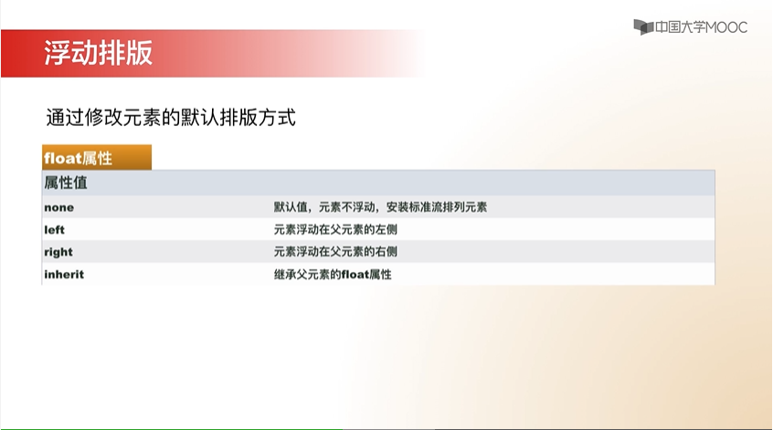
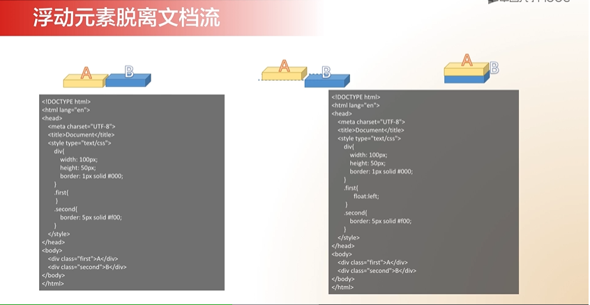

># HTML
>>## HtML基础
>>>### HTML标签知识
1. HTML标签元素由<>构成
2. 绝大多数标签由开始标签和结束标签组成，例如< ></>,开始标签不带/，而结束标签>>>则带有
3. 标签结构
    ```HTML
    < >//这是父标签  
        < >//这是子标签  
        </>
        < >//和上一个<>是兄弟标签
        </>
    </>
    ```
4. 也有部分标签是单标签，没有结束标签，例如：
    ```HTML
    <meta charset="UTF-8">
    4其中charset="UTF-8为标签的属性
    ```

>>> ### HTML常用标签语法<br>
1. `<title>Document</title>`<br>
这个标签为网页的标题，就是浏览器最上端显示的内容
2. `<h1>欢迎来到我的第一个站点</h1>`<br>
这个标签为网页中显示的标题，共有六个级别，1最大，6最小，示例如下：  
    <a href="index1/index.html">这是实例链接</a>
    <h1>欢迎来到我的第一个站点</h1>
    <h6>欢迎来到我的第一个站点</h6>

3. `<b>加粗</b>` 
这个标签为加粗包裹的字符，示例如下：  
    <a href="index1/index.html">这是实例链接</a><br>
    <b>加粗</b>

4. `<P>段落</p>`<br>
    用法类似于标题`<h></h>`示例如下：  
    <a href="index1/index.html">这是实例链接</a><br>

5. `<i>倾斜</i>`<br>
    倾斜包裹的字符，效果类似加粗`<b></b>`,示例如下：  
    <a href="index1/index.html">这是实例链接</a><br>

6. `<sup>上角标</sup>`<br>
将包裹的字符以上角标的形式显示出来，示例如下：<a href="index1/index.html">这是实例链接</a><br>
    EG<sup>上角标</sup>
7. `<sub>下标</sub>`<br>
同上。
8. `<del>删除线</del>`<br>
将包裹的字符显示成带删除线的样式，示例如下：<a href="index1/index.html">这是实例链接</a><br>
    <del>删除线</del>
9. `<strong>强调语句</strong>`<br>
此标签表示加重语气，显示样式与加粗一致，但语气更重，示例如下：<a href="index1/index.html">这是实例链接</a><br>
10. `<pre>原样输出(也叫预格式化)</pre>`<br>
此标签将会原样输出输入内容，包括换行、空格、等，示例如下：<a href="index1/index.html">这是实例链接</a><br>
11. `<ins>插入字</ins>`<br>
此标签将会将包裹内容以插入字的样式显示(下划线)，示例如下：<a href="index1/index.html">这是实例链接</a>
    <br><ins>插入字</ins>
12. `<br>`
此标签将会产生换行效果，html中回车并不会显示换行，而是增加一个空格，示例如下：<a href="index1/index.html">这是实例链接</a> 
13. `<bdo dir="*">显示方向<>`
此标签将会将包裹内容按照设定方向显示，*默认有两个参数，rtl和ltr，示例如下：<a href="index1/index.html">这是实例链接</a><br>
    ltr <bdo dir="ltr">方向</bdo><br>
    rtl <bdo dir="rtl">方向</bdo>

>>> ### 锚点和链接
1. `<a ###="***">链接（这是显示文本）</a>`<br>
此标签用于插入链接，<br>
`###`是具体属性名，`***`是具体属性值，不同属性之间用空格隔开，示例如下：<br>
    + href="`address`"<br>
    跳转到指定的位置，此位置可以是本地链接，也可以是url，<br>
    <a href="index1/index.html">这是实例链接[a-href"`*`"]</a>
    + target="`mode`"  `mode`--`_blank`<br>
    指定打开链接的模式，`_blank`表示新标签页打开<br>
    <a href="index1/index.html" target="_blank">这是实例链接[a-href"`***`" target"_blank"]</a>
    + herf="`address`#`ID值`"<br>
    此标签用于跳转到指定ID出，`#`必须有<br>
    `address`用于跳转到外部ID处
2. `<a id="***">锚点[ID属性]（这是显示文本）</a>`<br>
`<a name="#***">锚点[ID属性]（这是显示文本）</a>`<br>
此标签用于标记锚点，ID值在在页面中是唯一的，并且包裹的文本没有特殊样式，调用ID值可实现跳转功能，示例如下：<a href="index1/index.html">这是实例链接</a><br>
`<a id="1">This is ID</a>`<br>
`<a href="#1">The ID attribute is referenced here</a>`<br>
    <a id="1">This is ID</a><br>
    <a href="#1">The ID attribute is referenced here</a><br>
`<a name="#***">锚点[ID属性]（这是显示文本）</a>`<br>
用法同上

>>> ### 使用图片
1. 常用图片格式
    |格式|特性说明|
    |:-:|:-:|
    |JPEG|联合图形专家组标准，又称JPG，支持数百万种色彩，主要用于显示照片等色彩丰富的精美图像|
    |GIF |图形交换格式，是网页图像中流行的一种格式，它只能显示256种颜色，最适合色调不连续或具有大面积同一颜色的图形。此外，GIF还可以包含透明区域和多帧动画，适合卡通动画，透明logo等场合|
    |PNG |可移植网络图形，及融合了GIF透明显示的优点，又具有JPEG的丰富色彩，同时还能拥有很好的压缩体积，适合网络中传播，是一种流行的网络图像格式|
2. 图片插入语法
    +  ``  
    ###表示属性  
    \***表示属性值
        - src属性用于指定图片文件的存放路径，可以是本地文件，也可以是URL
            * 路径有相对路径和绝对路径两种  
            绝对路径：从盘符或根目录开始直到文件位置结束的路径  
            相对路径：从当前文件位置计算需要加载的文件的路径
        - alt属性用于图片无法加载书显示的文字
        - height属性用于定义图片的高度
        - width属性用于定义图片的宽度
        - title属性用于定义图片的提示信息  
示例如下：  
<a href="index1/page2.html">这是实例链接</a><br>  

>>## CSS3样式
>>>### 样式的3种引入方式
1. 第一种"内部样式"<a id="内部样式"></a>  
    ```html
    <head>###</head>
    ```   
    在头标签内创建css,###表示具体创建的css样式，创建方式如下：    
    ```html
    <!--内部样式-->
    <style type="text/css">
	h1{
		border: 1px solid #ccc;//边框
		width: 100px;//宽度
		height: 100px;//高度
		color: red;//颜色
	}
	</style>
    ```
    <a href="index2/index2.html">查看链接</a>  
    具体说明：
    + 语法格式：  
    选择器{
        属性名：属性值；
    }
    + `<style type="text/css">###</style>`
    样式创建标签，所创建的样式将包裹在内部
    + `xx{}`  
    [样式使用对象（选择器）：这里是对本页内容中所有的xx(xx表示本页中的意标记)标签有效]
    + `border: 1px solid #ccc;`  
    [属性名：边框样式]： \*[属性值：边框宽度] \**[边框模式] \***[属值：边框颜色] [;结束符]
    + `width: 100px;`  
    [属性名：宽度]：[属性值：宽度值] [;结束符]  
    + `height: 100px;`  
    [属性名：高度]：[属性值：宽度值] [;结束符] 
    + `color: red;`  
    [属性名：内部字体颜色]：[属性值：颜色值] [;结束符] 
    + 待添加 
2. 第二种"嵌入样式"  
    ```html
    <h1 style="font-size: 18px">第二个样式</h1>
    ```
    在`<body>###</body>`内创建，###表示具体创建的css样式。  
    <a href="index2/index2.html">查看链接</a>  
    具体说明：  
    + 语法格式：  
    <标签 style="属性：属性值">文本</标签>
    + 具体属性可查看网络文档（Google）
3. 第三种：外部样式  
    ```html
    <link rel="stylesheet" type="text/css" href="css/style.css">
    ```
    一般网站会在专门的css文件夹内放置css文档（样式表）  
    <a href="index2/css/style.css">这是css文件</a>  
    具体说明：  
    + 引入语法格式：  
    <引入标签 rel="stylesheet" type="text/css"[引入类型] href="URL"[样式文件路径]>
    + 引入标签在`<head></head>`标签内使用
    + 样式表内部语法与内部样式语法一致  
    <a href="#内部样式">内部样式</a> 

>>>### 盒子模型
1. 盒子图示
    + <h2>盒子结构模型</h2> 
      
    + <h2>盒子初始默认顺序</h2>  
    
2. HTML中的所有标签都可认为是一个一个的盒子

>>>### 边框样式
1. 定义边框样式  
    |属性名|属性值|用法|
    |:--:|:--:|:--:|
    |border-style|solid·dotted·dashed·double·none|boder-style:solid double dotted dashed;|
    |<a href="index2/index2.html">实例链接</a>|[实线][虚线][短划线][双实线][无]|属性:属性值1 属性值2 属性值3 属性值4|

    |属性|作用对象|
    |:--:|:--:|
    |border-top-style|    上边框    |
    |border-right-style|    右边框    |
    |border-bottom-style|    下边框    |
    |border-left-style|    左边框    |  
      
2. 技巧[值复制原则]
    + 当给定四个值时，上、右、下、左的顺序对应各边框线
    + 当给定一个值时，该值将应用到四条边上
    + 当给定两个值时，分别记为A、B，那么上下边框线取A值，左右边框线取B值
    + 当给定三个值时，分别记为A、B、C，那么上边框为A，右边框为B，下边框为C，左边框为B
3. 定义边框宽度  
    |属性名|属性值|用法|
    |:--:|:--:|:--:|
    |border-width|像素或者%或者thin、medium（默认值）和thick之一|border-width:2px|
    <a href="index2/index2.html">实例链接</a>  
4. |属性名|属性值|用法|
    |:--:|:--:|:--:|
    |border-color|blue/rgb(25%,35%,45%)/#909090/ transparent|border-color:red blue;|
    |<a href="index2/index2.html">实例链接</a>|[颜色名][rgb值][十六进制值][透明]|属性名:属性值|
      
5. 技巧：使用border属性
    |属性名|属性值|用法|
    |:--:|:--:|:--:|
    |border|width style color|border:1px solid red|
    <a href="index2/index2.html">实例链接</a>  

>>>### 背景样式
1. CSS背景  
    + 背景
        +   CSS允许使用纯色作为背景色，也可以使用背景图像创建丰富的背景效果
2. 背景样式属性
    |属性名|属性值|
    |:--:|:--:|
    |background-color|设置元素的背景色|
    |background-image|把图片设置为背景|
    |background-position|设置图片的起始位置|
    |background-repeat|设置背景图片的重复方式|
    |background-attachment|背景图像是否固定或者随着页面的其余部分滚动|
3. 技巧：使用background属性
    |属性名|属性值|用法|
    |:--:|:--:|:--:|
    |background|60px 500px red url（） no-repeat right|background:60px 500px red url() no-repeat right|
    |<a href="index2/index2.html">实例链接</a>|[颜色][图片路径][不重复][右侧]|属性名:属性值|
    
    + <b>宽高度不能在background内</b>
    + 小练习，无限拓展页面
    <a href="index3/index3_2.html" target="_blank"><h1>这是练习链接</h1></a>
    + 补充：
    |属性名|属性值|用法|
    |:--:|:--:|:--:|
    |margin|auto|margin:auto == margin: auto auto auto auto|
    |margin|#/auto|margin: # auto == margin: # auto # auto|
    |元素位置|参数/自动|示例|

    <a href="https://blog.csdn.net/dkmings/article/details/51661056">这是大佬的讲解</a>

>>>### CSS基本选择器
1. 语法规则
    + CSS规则主要有两个主要部分构成：选择器，以及一条或多条声明
    |选择器|声明|
    |:--:|:--:|
    |h1|{color:blue; font-size:12px}|
    |选择器标签|每一条声明用“;”结束，声明用来规定显示样式。声明构成"属性:值"|
2. 常见的基本选择器
    + 标签选择器
        + 直接使用HTML标签作为选择器
        + 定义方法：  
        `标签名{}`
    + id选择器
        + 在标签中使用id属性名命名，在CSS中使用(#id名)的形式作为选择器，同一个页面中id名不能重复，即id只能使用在一个元素中
        + 定义方法：  
        `#id名{}`
    + 类选择器
        + 在标签中使用class属性名命名，在CSS中使用(.class)的形式作为选择器,类样式可以被多个元素复用
        + 定义方法：  
        `.类名{}`
    
    <a href="index3/id.html"><h3>实例链接</h3></a>

>>>### CSS高级选择器
1. 伪类选择器  
    + 伪类是指逻辑上存在，但在文档树中不存在的“幽灵”分类，通常用于元素某些特定状态添加样式。  
    典型的应用就是：超链接添加未访问状态，悬停状态，活动状态和访问过这四种链接状态。  
    + 语法格式
        ```html
        选择器:伪类{
            属性1:属性值1……;
            属性2:属性值2……;
            ……
        }
        ```
        |伪类类型|描述|
        |:--|:--|
        |:link|将样式添加到未被访问过的链接|
        |:hover|当鼠标悬浮在元素上方式，向元素添加样式|
        |:active|将样式添加到被激活的样式|
        |:vlisted|将样式添加到已经被访问过的元素|
        |:first-child|将样式添加到文档树中每一层元素的指定类型的第一个子元素|
        |:focus|向当前被选中，获得焦点的元素添加样式|
        |:lang|向带有指定lang属性的元素添加样式|
        |:after|选择器在被选元素的内容后面插入内容,请使用 content 属性来指定要插入的内容|

        <a href="index4/index4_weilei.html">实例链接</a>

>>>### 浮动
1. CSS排版
    + CSS提供了四种排版模型
        + 标准流排版
            
        + 浮动排版
            + `float属性`
            |属性|属性值|说明|
            |:--|:--|:--|
            |float|none|默认值，元素不浮动，安装标准流排列元素|
            ||left|元素浮动在父元素的左侧|
            ||right|元素浮动在父元素的右侧|
            ||inherit|继承父元素的float属性|

            </a>

            + 浮动元素的特点
                + 浮动可以让块级元素在一行中显示  
                （块级元素：占据父容器的一整行）
        <a href="float/float.html"><h3>实例链接</h3></a>
                + 浮动元素脱离文档流  
                浮动的元素会脱离文档流
        
                + 父元素高度塌陷问题  
        <a href="float/float3.html"><h3>实例链接</h3></a>
                    + 解决方法
        `clear属性`
            |属性|属性值|说明|
            |:--|:--|:--|
            |clear|none|默认值，允许左，右两侧出现元素浮动|
            ||left|不允许左侧元素浮动|
            ||right|不允许右侧元素浮动|
            ||both|不允许左右两侧出现浮动元素|
            ||inherit|继承父元素的clear属性的值|

            + <h3>BFC</h3>

                + 什么是BFC：(Block Formatting Context)块级格式上下文，提供了独立的布局环境，环境中的内容不会影响到外部的布局，环境外的布局也不会影响到环境内的内容。就像是一个围墙，围墙中的内容出不来，围墙外的东西进不去。  
        <a href="https://www.w3school.com.cn/cssref/selector_after.asp">W3school链接</a>

                + 利用触发BFC解决浮动对布局的影响  
                基本思想：父元素没有指定高度时，实际高度由子元素撑开，而子元素的浮动属性，使之脱离文档流，从而导致父容器高度坍塌，如果给父元素加上一个围墙(BFC)，围墙能包含浮动元素，使之无法脱离父元素的区域，从而表现出清除浮动的效果。  
        <a href="float/float_4.html">实例链接</a>

            + 总结  
                + 浮动可以让块级元素在一行中显示
                + 浮动可以让行内元素具有块级元素特征
                + 浮动时直到碰到其他浮动框或者父容器的边框
                + 浮动脱离了标准文档流，父容器会造成坍塌
                + 使用清除浮动或者触发BFC来消除浮动对布局的影响
        + 定位排版
        + (3.0之后)flex排版

>>>### CSS定位
1. 什么是CSS定位
    + 层级之间的叠加现象，能够使信息呈现纵向空见发展
2. 常见的定位方式
    + 静态定位
    + 固定定位
    + 相对定位
    + 绝对定位
3. 定位排版属性position
    + position样式
	|属性|属性值|说明|
    |:--|:--|:--|
    |position|static|默认值，静态定位、无定位，元素按照文档流进行布局|
    |<a href="https://www.w3school.com.cn/cssref/pr_class_position.asp" target="_blank">w3school</a><a href="position/absolute.html" target="_blank">实例链接</a>|absolute|绝对定位，将对象从文档流中脱离出来，相对于最近的一个以定位的(相对/绝对)的祖先元素进行绝对定位;如果不存在这样的祖先元素，则相对于最外层包含框进行定位|
    |<a href="position/index1.html" target="_blank">固定定位</a>|fixed|固定定位，依据浏览器窗口来进行位置偏移|
    |<a href="position/relative.html" target="_blank">相对定位</a>|relative|相对于对象自身位置进行位置偏移(相对定位)|
    ||inherit|规定应该从父元素继承 position 属性的值|

    + 配套样式属性  
    |属性|属性值|说明|
    |:--|:--|:--|
    |与fixted,absolute,relative配套使用|top|元素向上的偏移量|
    ||left|元素向左的偏移量|
    ||right|元素向右的偏移量|
    ||bottom|元素向下的偏移量|
    + 定位层级z-index
    |属性值|说明|
    |:--|:--|
    |auto|默认值，层级高低与父元素相等|
    |number|指定元素的层级高低，值越大，层级越高|
    |inherit|继承父级元素的z-index属性值|
4. 综合实例：  
<h1><a href="jdms/jdms.html" target="_blank">京东秒杀</a></h1>


    

